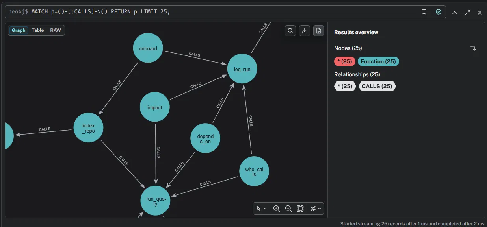
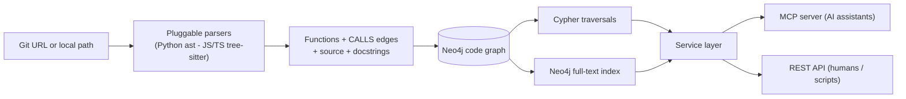

# CodeGraph — AI-Native Code Intelligence

> Give an AI the ability to **navigate an unfamiliar codebase like a senior engineer** — locate the right function from a plain-English intent, read it, and map the blast radius of changing it.

CodeGraph parses a repository (Python, JavaScript, TypeScript) into a **code graph** of functions and their call relationships, stores it in **Neo4j**, and exposes it to AI assistants through an **MCP server** (plus a REST API). An LLM can then answer the questions engineers actually fear before touching code: *where is this handled, what calls it, and what breaks if I change it* — autonomously, by chaining the tools.

Unlike pure embedding/RAG tools, it answers **structural** questions — because dependencies are *connections*, not text similarities.


*The full call graph of `psf/requests` — every function and `CALLS` relationship.*

---

## What makes this different

Most "chat with your codebase" tools do semantic search and stop there — they can tell you *what code means*, not *what depends on it*. CodeGraph pairs two complementary retrieval modes:

- **Findability** (`search_code`) — locate functions by intent, even without knowing names.
- **Structural traversal** (`impact_of_change`, `depends_on`, `who_calls`) — follow real call edges to compute the exact blast radius of a change.

Together they let an AI go from *"add retry logic to the request flow"* → the right function → everything that would break — which is the foundation for **minimal, scoped, traceable edits** instead of the sprawling changes AI coding agents are notorious for.

---

## The headline: an AI using CodeGraph through MCP

Connected as an MCP server in Claude Desktop, the assistant chains the tools on its own. A real, unedited example against `psf/requests`:

> **Prompt:** *"Find where the library prepares a request, read that function, and tell me what would break if I change it."*

The AI autonomously:
1. called `search_code("prepare request")` → located `PreparedRequest.prepare` (`src/requests/models.py:424`),
2. called `get_function_source(...)` → read the function and recognized it as an orchestrator of seven ordered sub-steps,
3. called `impact_of_change` / `depends_on` → traced the blast radius up through `Session.prepare_request → Session.request → the public API`, concluding **every request in the library flows through this function**,
4. and produced senior-level guidance: *adding an optional keyword arg is safe; reordering the sub-steps or changing the signature/return contract is dangerous* — because the ordering encodes load-bearing auth/hook dependencies.

No function names were given by the user. The AI located, read, and reasoned about impact entirely through CodeGraph's tools.


---

## Capabilities

| Tool (MCP) / Route (REST) | Purpose |
|---|---|
| `onboard` · `POST /onboard` | Index a repo (local path or public git URL) into the graph |
| `search_code` · `GET /query/search` | **Find functions by meaning/keyword** — full-text over name, docstring, and body |
| `get_function_source` · `GET /query/source` | Read a function's full source to confirm it's the right one |
| `who_calls` · `GET /query/who-calls` | Direct callers of a function |
| `impact_of_change` · `GET /query/impact` | Everything that **transitively calls** it — the blast radius |
| `depends_on` · `GET /query/depends-on` | Everything it transitively calls, with `hop` distance |
| `GET /memory/history` | Log of past onboards and queries |

Every query is exposed through **both** an MCP tool (for AI assistants) and a REST route (for humans / scripts), sharing a single service layer — no duplicated logic. Interactive API docs at **`/docs`**.

---

## Demo data — `psf/requests`

Onboarded straight from a GitHub URL:

```json
POST /onboard  { "repo_path": "https://github.com/psf/requests" }
→ { "functions_indexed": 711, "call_edges_indexed": 1548 }
```

**Find by intent** (`search_code` — note: query words don't have to match names):
```
"combines or merges settings"  →  merge_setting, merge_environment_settings,
                                   merge_hooks, merge_cookies
```

**Trace impact** (`impact_of_change`):
```
GET /query/impact?name=send&depth=3
→ { "target": "send", "depth": 3, "impacted_by_change": [
     { "name": "handle_401", "file": "src/requests/auth.py" }, ... ] }
```

**Trace dependencies with hop distance** (`depends_on`):
```
GET /query/depends-on?name=request&depth=3
→ { "depends_on": [
     { "name": "prepare_request", "file": "src/requests/sessions.py", "hop": 1 }, ... ] }
```


*Zoomed in: a cluster of functions and their `CALLS` edges.*

---

## How it works



1. **Parse** — a pluggable `LanguageBackend` per language: Python via the built-in `ast`, JavaScript/TypeScript/TSX via tree-sitter. Each extracts function definitions, the calls inside them, and the function's source + docstring.
2. **Resolve** — call names are matched to definitions to produce `CALLS` edges; each function gets a stable id (`path::name`).
3. **Store** — functions and edges written to **Neo4j** with idempotent `MERGE`; a **full-text index** over name/docstring/body powers `search_code`.
4. **Traverse** — `impact` / `depends-on` use variable-length Cypher paths (`[:CALLS*1..N]`) for transitive reach with `hop` distance.
5. **Expose** — one **service layer** is the single source of truth; thin **MCP** and **REST** adapters call it.

The pluggable parser interface means adding a language is one small backend class — TypeScript/TSX, for example, inherit the JS backend and only swap the grammar.

---

## Evaluation

Retrieval quality is **measured, not asserted.** The `evals/` folder contains a labelled
ground-truth set of intent → function pairs for `psf/requests`, split into two groups to make
results *diagnostic*:

- **Word-overlap** queries — the intent shares vocabulary with the code (e.g. *"merge settings"* → `merge_setting`). Tests whether keyword search *works*.
- **Concept-only** queries — the intent uses different words than the code (e.g. *"retry against a server that asks for login"* → `handle_401`). Tests whether keyword search is *enough*.

Measured top-3 localization accuracy of `search_code`:

| Query type | Top-3 accuracy |
|---|---|
| Word-overlap | **83%** (10/12) |
| Concept-only | **12%** (1/8) |

This split drove a real engineering decision. The initial keyword ranking scored **50%** even on
word-overlap queries — diagnosed (via the eval) as function *bodies* and *test files* polluting the
ranking. Re-ranking in Cypher to boost name matches and exclude test files lifted word-overlap to
**83%**; the two remaining misses are sibling ties (e.g. `merge_setting` vs `merge_environment_settings`),
not failures.

The **12%** on concept-only queries is the clean, isolated limitation of keyword search — every miss
is a case where the meaning matches but the words don't (*"character set"* vs `encoding`,
*"asks for login"* vs `401`). That is precisely what a **hybrid semantic layer** addresses, which is
why it's on the roadmap — justified by measurement, not assumed.

```bash
# run the localization eval (exact-match, no API key needed)
python -m evals.eval_search
```

---

## Tech stack

- **Python** + **FastAPI** — service and REST layer
- **MCP (Model Context Protocol)** — exposes the graph as tools any AI assistant can call
- **Neo4j** — persistent code graph (Cypher traversals) + full-text search index
- **tree-sitter** (JS/TS/TSX) + **`ast`** (Python) — multi-language parsing behind a pluggable interface
- **SQLite** — analysis-history memory
- **Docker / docker-compose** — one-command Neo4j + API stack

---

## Quick start

> Prerequisites: Docker, Python 3.12+, `git`.

```bash
git clone https://github.com/amitesh1234/codegraph-advanced.git
cd codegraph-advanced

# Start Neo4j (Browser: http://localhost:7474 — neo4j / password)
docker compose up -d neo4j

# Run the API
python -m venv .venv
source .venv/bin/activate          # Windows: .venv\Scripts\activate
pip install -r requirements.txt
uvicorn app.main:app --reload      # docs at http://localhost:8000/docs

# Onboard a repo
curl -X POST http://localhost:8000/onboard \
  -H "Content-Type: application/json" \
  -d '{"repo_path": "https://github.com/psf/requests"}'
```

### Connect to Claude Desktop (MCP)

Add to `claude_desktop_config.json`:
```json
{
  "mcpServers": {
    "codegraph": {
      "command": "/abs/path/to/codegraph-advanced/.venv/bin/python",
      "args": ["app/mcp_server.py"],
      "cwd": "/abs/path/to/codegraph-advanced"
    }
  }
}
```
Restart Claude Desktop, then ask: *"Using codegraph, find where requests are prepared and tell me what would break if I change it."*

See **[DEPLOYMENT.md](DEPLOYMENT.md)** for the full-Docker stack and cloud (Neo4j AuraDB) deployment.

---

## Known limitations

A **static, best-effort** call graph — honest about what it captures:

- **Name-based resolution.** Calls are matched by function name, so a call to `send` links to *every* `send` in the repo. It doesn't yet resolve types/imports to pick the exact target — so the graph can over-report. (Semantic resolution is on the roadmap.)
- **Dynamic dispatch isn't captured** — reflection, `getattr`, runtime-resolved calls are invisible to static analysis (formally undecidable in general).
- **Keyword search has a measured ceiling.** `search_code` is full-text (with Cypher re-ranking), so it localizes vocabulary-overlap intents well (**83%**) but concept-only intents poorly (**12%**) — see [Evaluation](#evaluation). A hybrid semantic layer is the planned fix.

---

## Roadmap

- **Hybrid semantic search** (embeddings layered over full-text) for intent queries that don't share vocabulary with the code — directly targets the measured 12% concept-only gap.
- **Semantic call resolution** (SCIP / LSP / CPG) to replace name-based matching — sharpens blast-radius accuracy.
- **Scoped-edit guardrail** — use the dependency graph to bound an AI agent's edits to the change's real perimeter, flagging anything out of scope (the "minimal, traceable edits" payoff).
- **Document onboarding** — ingest PRDs / design docs alongside code so the agent reasons about intent, not just structure.

---

## License

MIT